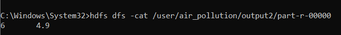

# Hadoop Air Pollution Analysis
## Table of Contents

1. [Overview](#overview)
2. [Features](#features)
3. [Prepare the Dataset](#prepare-the-dataset)
4. [Prerequisites and Technologies Used](#prerequisites-and-technologies-used)
5. [Steps to Run the Project](#steps-to-run-the-project)
6. [MapReduce Job Descriptions](#mapreduce-job-descriptions)
7. [Example Output](#example-output)
8. [Troubleshooting](#troubleshooting)


## Overview
This project analyzes air pollution data using Hadoop MapReduce. It processes a large dataset of air pollution measurements, specifically focusing on air quality index (AQI) and CO concentration, and calculates various insights such as the average AQI per state, highest CO concentration, and AQI values above a certain threshold.

The dataset contains air pollution data for various local site names of a state, and the analysis aims to provide useful information for environmental studies and policy-making.

## Features
- **Average AQI Calculation**: Computes the average AQI for each state.
- **Highest CO Concentration**: Finds the highest CO concentration for each city or state.
- **AQI Above Threshold**: Filters cities or states with AQI values above a predefined threshold.

## Prepare the Dataset

1. **Upload the Dataset**:  
   Place your air pollution dataset (`air_pollution.csv`) in the `input` directory of your Hadoop setup.
*(Note: The dataset file has already been included in the `input` directory for your convenience.)*


2. **Verify Dataset Format**:  
   Ensure the dataset follows the structure described in the "Dataset" section, including key columns such as:
   - **Date**: The date of measurement.
   - **City/State**: The location where air quality data was collected.
   - **Daily Max 8-hour CO Concentration**: Maximum 8-hour CO concentration measured in parts per million (ppm).
   - **Daily AQI Value**: The calculated Air Quality Index for the day.
   - **County/CBSA Name**: County and metropolitan area names.
   - **Site Latitude and Longitude**: Geographic coordinates of the measurement site,
   and **more**.

3. **Explore and Download Data**:  
   If you do not already have a dataset, you can explore and download air quality data for various geographical areas (states, countries, etc.) from [EPA's Outdoor Air Quality Data](https://www.epa.gov/outdoor-air-quality-data/download-daily-data).

## Prerequisites and Technologies Used

Ensure you have the following installed on your system:
- **Hadoop** (configured and running) : For distributed processing using MapReduce.
- **Java JDK** (required by Hadoop)
- **HDFS** (Hadoop Distributed File System): For storing and processing large datasets.
- Knowledge of Java, for implementing the MapReduce logic.

## Steps to Run the Project

1. **Clone the repository**:
   Clone this repository to your local machine:
   ```bash
   git clone https://github.com/Aakash2003jain/Hadoop-AirPollution-Analysis.git
   ```   

2. **Code Compilation and JAR Creation**:  
   Compile the Java MapReduce code and package it into a JAR file. Run these commands from the project directory.

   - **Compile the Code**:  
     Run the following command to compile the Java files:  
     ```bash
     javac -classpath "$(hadoop classpath)" -d ./build src/*.java
     ```
     - Ensure the `src/` directory contains your Java source files.
     - The compiled class files will be placed in the `build/` directory.

   - **Create the JAR File**:  
     Run the following command to package the compiled files into a JAR:  
     ```bash
     jar -cvf air_pollution.jar -C build/ .
     ```
     - This command packages the files from the `build/` directory into a JAR file named `air_pollution.jar`.

   **Note**:
   - These commands must be executed in the terminal from the root directory of your project.
   - For your convenience, the `air_pollution.jar` file has already been included in the root folder of this repository. You can use it directly without recompiling, unless you make modifications to the code.


3. **Hadoop Setup and Uploading Dataset into HDFS**:

    - **Start Hadoop Services**:  
      Ensure that Hadoop services are running. Use the following commands to start the Hadoop cluster:  
      ```bash
      start-all
      ```
   - **Uploading Dataset into HDFS**:
     
     Once the Hadoop services are running, the next step is to upload your dataset to HDFS so that it can be processed by the MapReduce jobs.
     
     1. **Create a directory in HDFS for your input data:** To organize your data, create a directory in HDFS where you will store the input files:
        ```bash
        hdfs dfs -mkdir /user/air_pollution/input
        ```
        
     2. **Upload the Dataset into HDFS:** Now, you can upload your dataset,
        ```bash
        hdfs dfs -put /path/to/local/air_pollution.csv /user/air_pollution/input
         ```
         **Note**: Replace /path/to/local/air_pollution.csv with the actual path to your local dataset.
        
     3. **Verify that the file has been uploaded using:**
         ```bash
         hdfs dfs -ls /user/air_pollution/input
         ```
     
      4. **Check the Dataset in HDFS:** To make sure the file has been uploaded successfully, you can check the contents of the `input` directory:
         ```bash
         hdfs dfs -cat /user/air_pollution/input/air_pollution.csv
         ```

 4. **Run the MapReduce Job**:  
     Once the dataset is uploaded to HDFS, you can run the MapReduce job using the `hadoop jar` command. Ensure that your JAR file is correctly compiled and contains the main class for execution.
     1. **Run the Average AQI job**:
        ```bash
        hadoop jar air_pollution.jar AverageAQI /user/air_pollution/input /user/air_pollution/output1
        ```
     2. **Run the Highest CO job**:
         ``` bash
         hadoop jar air_pollution.jar HighestCO /user/air_pollution/input /user/air_pollution/output2
         ```
     3. **Run the AQIAboveThreshold job**:
        ```bash
        hadoop jar air_pollution.jar AQIAboveThreshold /user/air_pollution/input /user/air_pollution/output3
        ```
           **Note**:  Replace air_pollution.jar with the actual path of air_pollution.jar.

 5. **Check the Output**:
    
    After the job runs successfully, you can view the results using:
    ```bash
    hdfs dfs -cat /user/air_pollution/output1/part-r-00000
    hdfs dfs -cat /user/air_pollution/output2/part-r-00000
    hdfs dfs -cat /user/air_pollution/output3/part-r-00000
    ```
    
## MapReduce Job Descriptions

This project includes three key MapReduce jobs designed to process the air pollution dataset:

1. **Average AQI Calculation**:
   - **Description**: This job calculates the average Air Quality Index (AQI) for each state.
   - **Input**: The input dataset, where each record contains the AQI value for a specific city/state.
   - **Output**: A file containing the average AQI value for each state.

2. **Highest CO Concentration**:
   - **Description**: This job finds the highest CO concentration recorded for each city/state in the dataset.
   - **Input**: The input dataset, where each record contains the CO concentration for a specific city/state.
   - **Output**: A file containing the highest CO concentration for each city/state.

3. **AQI Above Threshold**:
   - **Description**: This job filters cities or states with AQI values above a predefined threshold (e.g., 100). It helps identify areas with poor air quality.
   - **Input**: The input dataset, where each record contains the AQI value for a specific city/state.
   - **Output**: A file containing the count of cities/states with AQI values exceeding the threshold.

## Example Output

The following are the results generated from running the MapReduce jobs on the air pollution dataset:

1. **Average AQI Calculation**:
   - This output shows the average AQI value calculated for each state.
   

2. **Highest CO Concentration**:
   - This output shows the highest CO concentration recorded in each city/state.
   

3. **AQI Above Threshold**:
   - This output shows the count of cities/states where AQI exceeds a threshold value (here the value is 10).
   


## Troubleshooting

Here are some common issues you may encounter and how to resolve them:

1. **Issue**: `Error: Failed to connect to the Hadoop cluster`
   - **Solution**: Ensure that your Hadoop services are running. Use the `start-all` command to start all Hadoop daemons.

2. **Issue**: `ClassNotFoundException`
   - **Solution**: Ensure that the correct JAR file is specified and that the main class is properly defined in the JAR.

3. **Issue**: `File not found in HDFS`
   - **Solution**: Ensure that the dataset is correctly uploaded to HDFS using the `hdfs dfs -put` command. You can verify the upload using `hdfs dfs -ls`.

4. **Issue**: `Output directory already exists`
   - **Solution**: If you are rerunning a job, make sure to delete the existing output directory in HDFS using `hdfs dfs -rm -r /user/air_pollution/output`.
   


        
   
   


         
   
   


   


  
   

